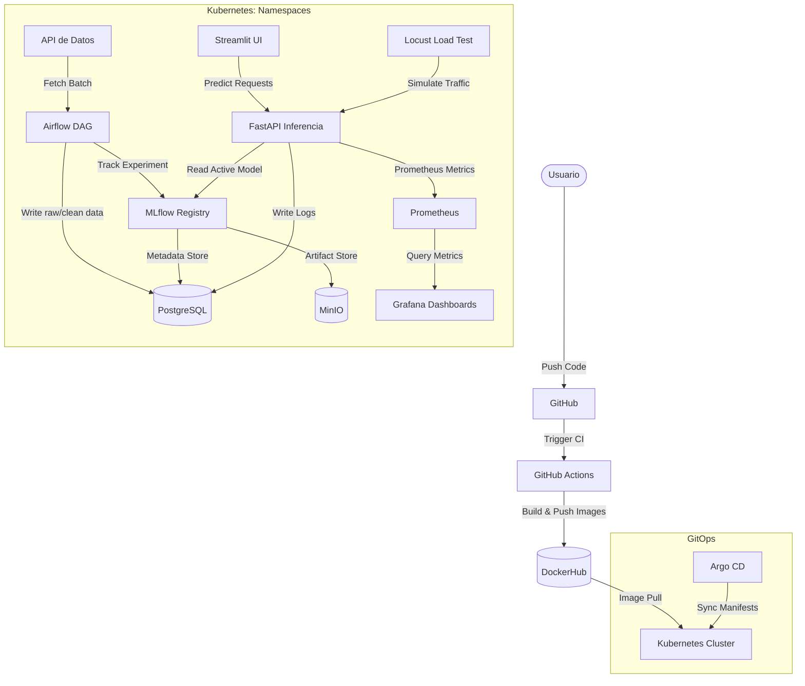
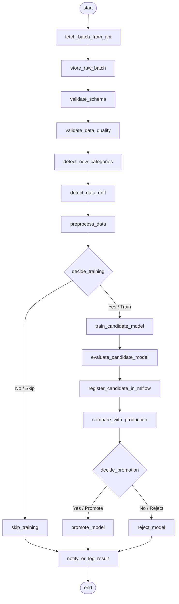

# MLOps Proyecto Final — Nivel 4: Automatización, decisión de reentrenamiento y despliegue GitOps

**Pontificia Universidad Javeriana — Maestría en Inteligencia Artificial**

**Curso:** Operaciones de Machine Learning

**Estudiantes:**
* Juan Navas
* Camila Cuellar
* Jhonathan Murcia

> Sistema MLOps que recolecta datos por lotes desde una API externa, los valida y procesa,
> **decide automáticamente si reentrenar**, registra experimentos en MLflow, **promueve el
> modelo solo si mejora al productivo**, y expone inferencia vía FastAPI tomando MLflow como
> única fuente de verdad. Todo desplegado en Kubernetes y sincronizado con **Argo CD (GitOps)**.

---

## Problema

**Regresión:** estimar el `price` de una propiedad a partir de 12 variables estructurales,
geográficas y comerciales (bed, bath, acre_lot, house_size, city, state, zip_code, etc.).

Los datos **no se entregan completos**: llegan **por lotes** desde una API externa
(`cristiandiaz13/mlops-puj:data-api-pf-v1`). Cada ejecución del DAG consume un lote y decide,
con reglas técnicas, si amerita reentrenar.

**Métrica prioritaria:** MAE (con RMSE, MAPE y R² de apoyo).
**Regla de promoción:** promover el candidato solo si **MAE baja ≥ 3 %** y **RMSE no empeora > 1 %**.

---

## Arquitectura



### Componentes

| Componente | Tecnología |
|---|---|
| Orquestación | Apache Airflow (Helm) | 
| RAW / CLEAN DATA | PostgreSQL 15 (`raw_properties` / `clean_properties`) |
| Object storage (artefactos) | MinIO | 
| ML Tracking / Registry | MLflow 2.22.0 (backend Postgres) | 
| API de inferencia | FastAPI + Uvicorn |
| Interfaz | Streamlit (inferencia + historial) | 
| Observabilidad | Prometheus + Grafana |
| Pruebas de carga | Locust 2.24.0 |
| CI | GitHub Actions → DockerHub |
| GitOps | Argo CD |

---

## Flujo del DAG (`dags/realty_pipeline.py`)

19 tareas con **dos bifurcaciones explícitas**:



- **`decide_training`** (RF4): entrena solo si hay drift / nuevas categorías frecuentes /
  crecimiento de volumen / degradación — no por periodicidad.
- **`decide_promotion`** (RF6): promueve solo bajo la regla de MAE/RMSE.
- Cada lote queda registrado en la tabla `training_audit`, fuente del historial en Streamlit.

---

## Datos (RF2)

| Tabla | Rol |
|---|---|
| `raw_properties` | Lotes tal como llegan de la API + metadatos de ingestión (RF1/RF2) |
| `clean_properties` | Datos transformados y listos para entrenar, trazables al lote crudo |
| `training_audit` | Decisión por lote: validaciones, drift, entrenó/no, promovió/no, métricas (RF4/RF9) |
| `inference_logs` | Registro de cada inferencia: entrada, `predicted_price`, versión de modelo (RF8) |

---

## API de inferencia (RF7/RF8)

MLflow es la **única fuente de verdad**: el modelo se carga por alias `models:/realty-champion@champion`.

| Endpoint | Método | Descripción |
|---|---|---|
| `/health` | GET | Estado de la API y del modelo cargado |
| `/predict` | POST | Estima el precio de una propiedad |
| `/model-info` | GET | Nombre, versión y alias del modelo activo |
| `/reload` | POST | **Recarga el modelo desde MLflow sin redesplegar** (admin, token) |
| `/metrics` | GET | Métricas Prometheus |

La recarga es atómica con fallback al modelo previo si la descarga falla (ver `ModelCache` en `src/api/main.py`).

---

## Despliegue (GitOps con Argo CD)

> Kubernetes consume imágenes **desde DockerHub** (construidas por GitHub Actions). No se construyen
> imágenes en la máquina de despliegue ni se usa `kubectl apply` manual como mecanismo principal.

### Paso 1: Levantar el Clúster Local
Se puede usar Docker Desktop (Kubernetes habilitado) o Minikube (mínimo 4 CPUs y 8 GB RAM):
```bash
# Si se usa Minikube:
minikube start --cpus 4 --memory 8192 --addons ingress,metrics-server
```

### Paso 2: Instalar Argo CD en el Clúster
```bash
kubectl create namespace argocd
kubectl apply --server-side -n argocd -f https://raw.githubusercontent.com/argoproj/argo-cd/stable/manifests/install.yaml
```

### Paso 3: Aplicar Namespace y Secretos de Base (Indispensable)
Dado que Argo CD lee la definición declarativa de aplicaciones, los secretos y namespaces base se definen primero para habilitar credenciales:
```bash
kubectl apply -f k8s/namespaces.yaml
kubectl apply -f k8s/secrets.yaml
```

### Paso 4: Registrar y Sincronizar las Aplicaciones en Argo CD
Aplica los manifiestos de sincronización para desplegar los microservicios del proyecto y el clúster de Airflow:
```bash
# Desplegar Postgres, MinIO, MLflow, API, UI, Locust y Observabilidad
kubectl apply -n argocd -f argocd/application.yaml

# Desplegar Airflow (vía Helm con values declarativos)
kubectl apply -n argocd -f argocd/application-airflow.yaml
```

### Paso 5: Inicialización de la Base de Datos de Airflow (Si se requiere)
En entornos Airflow 3.x con FabAuthManager, si los pods quedan esperando migraciones, corre estos comandos en el scheduler para actualizar el esquema:
```bash
kubectl exec -n airflow statefulset/realty-airflow-scheduler -c scheduler -- airflow db migrate
kubectl exec -n airflow statefulset/realty-airflow-scheduler -c scheduler -- airflow fab-db migrate
```

---

## Acceso a los servicios (NodePort / Localhost)

Si estás usando **Docker Desktop**, los servicios NodePort son directamente accesibles en tu `localhost`. Si usas **Minikube**, puedes obtener la URL o port-forwardearlos.

| Servicio | Puerto Localhost | Namespace | Service Name |
|---|---|---|---|
| Airflow Web UI | `http://localhost:30088` | `airflow` | `realty-airflow-webserver` |
| FastAPI de Inferencia | `http://localhost:30800` | `api` | `realty-api-svc` |
| Streamlit UI | `http://localhost:30801` | `streamlit` | `realty-ui-svc` |
| MLflow Tracking | `http://localhost:30500` | `mlflow` | `mlflow-svc` |
| MinIO Console | `http://localhost:30900` | `minio` | `minio-console-svc` |
| Locust Load Test | `http://localhost:30089` | `locust` | `locust-svc` |
| Prometheus | `http://localhost:30909` | `prometheus` | `prometheus-svc` |
| Grafana (admin/admin2026) | `http://localhost:30300` | `grafana` | `grafana-svc` |

---

---

## Estructura del repositorio

```
.
├── .github/workflows/      # CI: build & push de imágenes a DockerHub (nuevo)
├── argocd/                 # Application de Argo CD (nuevo)
├── dags/
│   └── realty_pipeline.py  # DAG con bifurcaciones (decisión de entrenamiento y promoción)
├── src/
│   ├── ingestion/          # cliente robusto de la API de datos (nuevo)
│   ├── api/                # FastAPI de inferencia (regresión + recarga RF7)
│   └── ui/                 # Streamlit (inferencia + historial)
├── docker/                 # Dockerfiles (api, ui, mlflow, airflow)
├── k8s/                    # Manifiestos: postgres, minio, mlflow, airflow, api, ui, locust, observabilidad
├── migrations/             # Esquema SQL (raw/clean/audit/inference)
├── locust/                 # Prueba de carga
└── README.md
```

---


## Decisiones de diseño

- **Regresión con `TransformedTargetRegressor(log1p)`**: el modelo es un `Pipeline` de scikit-learn que
  incluye su propio preprocesamiento (imputación + `OrdinalEncoder` con `handle_unknown`). Así la API
  envía **features crudas** y el modelo hace todo internamente — clave para RF7 (no se quema preprocesamiento
  en la API). Se entrena sobre `log(price)` y se predice en escala de precio.
- **Métrica prioritaria: MAE** (con RMSE/MAPE/R² de apoyo). Regla de promoción: promover solo si
  **MAE baja ≥ 3 % y RMSE no empeora > 1 %**. MAPE se reporta pero no se usa como criterio porque hay
  precios muy bajos que lo inflan.
- **Tabla `training_audit` como fuente de verdad del historial**: cada lote escribe una fila (decisión,
  razón, drift, métricas, promoción). Es lo que lee Streamlit (RF9) y desacopla las tareas del DAG.
- **Categóricas como texto en CLEAN** (no pre-codificadas): el encoding vive en el `Pipeline` del modelo,
  manteniendo coherencia entre entrenamiento e inferencia.
- **Un namespace por servicio** (10 ns) con Secret replicado y DNS FQDN (`svc.namespace`), por recomendación
  del docente (estilo Proyecto 3 ampliado).
- **Airflow vía Helm chart oficial** (no manifiestos crudos): Airflow 3.x requiere api-server + scheduler +
  dag-processor + triggerer; el chart los gestiona. DAGs y código del pipeline **horneados en la imagen**
  (self-contained, sin gitSync/PVC).
- **`mlflow-skinny` en la imagen de Airflow**: las tareas solo necesitan el cliente de tracking/registry,
  no el servidor; evita el choque de dependencias (Flask/SQLAlchemy) con Airflow.
- **CI como fuente de imágenes**: Kubernetes consume de DockerHub; no se construyen imágenes en la máquina
  de despliegue.

---

## Problemas encontrados y soluciones

| Problema | Causa | Solución |
|---|---|---|
| Migración de Airflow fallaba (`DeclarativeBase`) | Instalar mlflow/sklearn sin las *constraints* de Airflow rompía SQLAlchemy | Imagen con `--constraint` oficial de Airflow + `mlflow-skinny` + base `3.0.6-python3.12` |
| Conflicto `packaging<25` vs constraints | mlflow pide `<25`, Airflow fija `==25` | Relajar solo esa línea de las constraints (`sed`) |
| api-server de Airflow en CrashLoop | Con varios workers de uvicorn los primeros mueren | `AIRFLOW__API__WORKERS=1` |
| `DagBag import timeout` al ejecutar tareas | El DAG importa sklearn/mlflow (pesado) | Subir `AIRFLOW__CORE__DAGBAG_IMPORT_TIMEOUT=120` |
| API no cargaba el modelo (`No module named '_loss'`) | sklearn distinto entre entrenamiento (1.7.1) e inferencia (1.4.2) | Alinear **scikit-learn 1.7.1** en ambas imágenes |
| PVCs en `Pending` | Manifiestos pedían `storageClassName: local-path` (de k3s) | Quitarlo → usar `standard` (default de minikube) |
| `data-api` y tareas con `OOMKilled` | Lotes muy grandes (hasta ~360k filas) en nodo de 6 GB | Subir Docker/WSL a 10 GB, minikube a 8 GB, `data-api`/scheduler a 3 GB, y **cap de 60k filas** en el fit |
| `minikube image load :latest` no refrescaba | Tag `latest` cacheado en el nodo | Usar tag único o `imagePullPolicy`/CI |

---

## Video de sustentación

El video con la sustentación y demostración de este proyecto MLOps se encuentra disponible en YouTube a través del siguiente enlace:

* **Enlace al Video:** [Sustentación Proyecto MLOps — Grupo 1 (YouTube)](https://www.youtube.com/watch?v=BWBcm6uu9Fk)
